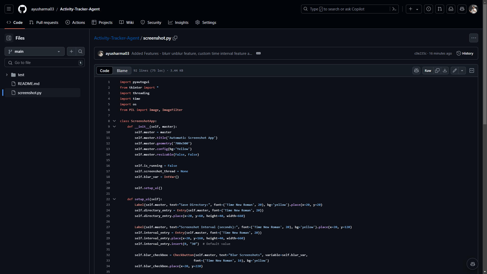

# 📸 Automatic Screenshot App

## 📝 Overview
The **Automatic Screenshot App** is a Python desktop application built using `Kivy` for capturing periodic screenshots. The app allows users to specify the interval between screenshots and choose between blurred or non-blurred screenshots.

A **React-based web application** is provided to remotely configure these settings. The desktop app reads and applies these settings, including screenshot intervals, blur options, and saving preferences.

## ✨ Features
- 🖼️ **Automatic Screenshots**: Capture periodic screenshots based on the interval set in the web app.
- 🌀 **Optional Blur**: Apply a Gaussian blur filter to screenshots if enabled through the web interface.
- 📂 **Save Directory**: Automatically save screenshots to a specified location.
- 🛑 **Start/Stop Functionality**: Start and stop the screenshot process, with settings controlled remotely via the web app.

### 🌐 Web Application Integration
The React-based web application provides an easy-to-use interface where users can:
- Set the interval for screenshot captures.
- Choose whether to blur screenshots.
- Enable or disable screenshot capturing.
- Specify the save directory for screenshots.

Changes made in the web app are reflected in the Python desktop application in real-time, ensuring smooth configuration management.

## 💻 Requirements
- Python 3.x
- Required Python libraries:
  - `kivy`
  - `pyautogui`
  - `Pillow`
  - `requests` (to fetch settings from the web app)

## ⚙️ Installation
1. **Clone the repository:**
   ```bash
   git clone https://github.com/nitishkumar333/Activity-Tracker-Agent.git
   ```

2. **Install required libraries:**
   Install the necessary Python packages by running:
   ```bash
   pip install kivy pyautogui Pillow requests
   ```

3. **Run the desktop app:**
   Execute the Kivy-based app with:
   ```bash
   python screenshot_app.py
   ```

## 🚀 Usage

### Desktop App
The desktop application automatically reads settings from the web app, including:
1. **⏱️ Screenshot Interval**: The interval between screenshots is determined by the settings configured in the React-based web app.
   
2. **🔍 Blur Option**: The app will blur screenshots if this option is enabled via the web app.

3. **📂 Save Directory**: Screenshots are saved to the directory set in the web app, ensuring all files are stored in the desired location.

4. **🎮 Start/Stop Screenshots**: The web app controls the start and stop functionality, providing a seamless integration between the web and desktop apps.

### Web App
1. **Login**: Access the React web app to configure the screenshot settings.
   
2. **Configure Settings**: Set the interval for screenshots, blur preferences, and save location.

3. **Real-time Sync**: The desktop app reads these settings in real-time and adjusts its behavior accordingly.

## 🖼️ Screenshots
| **User Login**                                   | **Blurred Screenshot**                           | **Non-Blurred Screenshot**                            |
|------------------------------------------------------|---------------------------------------------------------|-------------------------------------------------------|
|   |  |  |

---

## 🛠️ Known Issues
- Ensure that the save directory exists or will be created if it doesn't already exist.

## 🔮 Future Enhancements
- 🖼️ Add options to select screenshot formats (e.g., PNG, JPG).
- 🎨 Allow advanced image filters and transformations.
- 📐 Add screenshot area selection functionality.


<!-- 

# Getting Started with Create React App

This project was bootstrapped with [Create React App](https://github.com/facebook/create-react-app).

## Available Scripts

In the project directory, you can run:

### `npm start`

Runs the app in the development mode.\
Open [http://localhost:3000](http://localhost:3000) to view it in your browser.

The page will reload when you make changes.\
You may also see any lint errors in the console.

### `npm test`

Launches the test runner in the interactive watch mode.\
See the section about [running tests](https://facebook.github.io/create-react-app/docs/running-tests) for more information.

### `npm run build`

Builds the app for production to the `build` folder.\
It correctly bundles React in production mode and optimizes the build for the best performance.

The build is minified and the filenames include the hashes.\
Your app is ready to be deployed!

See the section about [deployment](https://facebook.github.io/create-react-app/docs/deployment) for more information.

### `npm run eject`

**Note: this is a one-way operation. Once you `eject`, you can't go back!**

If you aren't satisfied with the build tool and configuration choices, you can `eject` at any time. This command will remove the single build dependency from your project.

Instead, it will copy all the configuration files and the transitive dependencies (webpack, Babel, ESLint, etc) right into your project so you have full control over them. All of the commands except `eject` will still work, but they will point to the copied scripts so you can tweak them. At this point you're on your own.

You don't have to ever use `eject`. The curated feature set is suitable for small and middle deployments, and you shouldn't feel obligated to use this feature. However we understand that this tool wouldn't be useful if you couldn't customize it when you are ready for it.

## Learn More

You can learn more in the [Create React App documentation](https://facebook.github.io/create-react-app/docs/getting-started).

To learn React, check out the [React documentation](https://reactjs.org/).

### Code Splitting

This section has moved here: [https://facebook.github.io/create-react-app/docs/code-splitting](https://facebook.github.io/create-react-app/docs/code-splitting)

### Analyzing the Bundle Size

This section has moved here: [https://facebook.github.io/create-react-app/docs/analyzing-the-bundle-size](https://facebook.github.io/create-react-app/docs/analyzing-the-bundle-size)

### Making a Progressive Web App

This section has moved here: [https://facebook.github.io/create-react-app/docs/making-a-progressive-web-app](https://facebook.github.io/create-react-app/docs/making-a-progressive-web-app)

### Advanced Configuration

This section has moved here: [https://facebook.github.io/create-react-app/docs/advanced-configuration](https://facebook.github.io/create-react-app/docs/advanced-configuration)

### Deployment

This section has moved here: [https://facebook.github.io/create-react-app/docs/deployment](https://facebook.github.io/create-react-app/docs/deployment)

### `npm run build` fails to minify

This section has moved here: [https://facebook.github.io/create-react-app/docs/troubleshooting#npm-run-build-fails-to-minify](https://facebook.github.io/create-react-app/docs/troubleshooting#npm-run-build-fails-to-minify) -->
